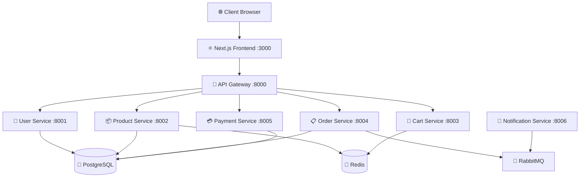

# 🏗️ Architecture Overview

## System Architecture

NexStore follows a **microservices architecture** with the following key principles:

- **Service Isolation**: Each service owns its data and business logic
- **API Gateway**: Single entry point for all client requests
- **Event-Driven**: Async communication via RabbitMQ for side effects
- **Cache-First**: Redis caching for frequently accessed data

## Service Map



## Data Flow

### 1. User Registration & Login
```
Client → API Gateway → User Service → PostgreSQL
                    ↓
              JWT Token ← Response
```

### 2. Product Browsing
```
Client → API Gateway → Product Service → Redis (cache check)
                                      ↓ (cache miss)
                                   PostgreSQL → Redis (cache set)
```

### 3. Order Placement
```
Client → API Gateway → Order Service → PostgreSQL
                                    ↓
                              RabbitMQ → Notification Service → Email/SMS
                                    ↓
                              Payment Service → Payment Gateway
```

## Design Decisions

See [Architecture Decision Records (ADRs)](adr/) for detailed rationale behind key decisions.

| ADR | Decision | Status |
|-----|----------|--------|
| ADR-001 | Use FastAPI for backend services | ✅ Accepted |
| ADR-002 | Redis for cart persistence | ✅ Accepted |
| ADR-003 | JWT for authentication | ✅ Accepted |
| ADR-004 | RabbitMQ for async messaging | ✅ Accepted |
| ADR-005 | API Gateway pattern | ✅ Accepted |

## Scalability

- **Horizontal**: Each service scales independently
- **Database**: Read replicas for product catalog
- **Caching**: Redis cluster for high availability
- **CDN**: Static assets served via CDN in production
